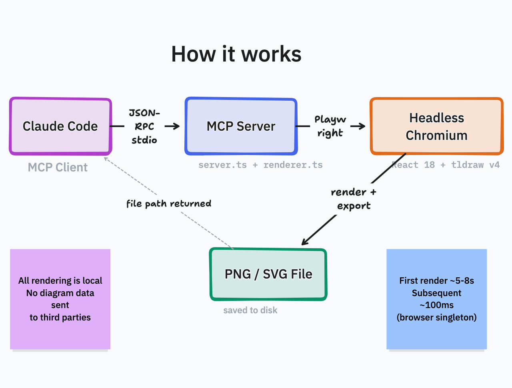

# tldraw-render

Headless tldraw diagram renderer for **Claude Code CLI** and other MCP clients. Renders diagrams as PNG or SVG — all rendering happens locally, not on tldraw's servers.

## How it works



The MCP server launches a headless Chromium singleton that loads React 18 + tldraw from CDN. First render takes ~5-8s (browser init), subsequent renders ~100ms.

## Install

### One command (npm)

```bash
# Claude Code
claude mcp add --scope user --transport stdio tldraw -- npx -y tldraw-render

# Or with any MCP client
npx -y tldraw-render
```

### From source

```bash
git clone https://github.com/bassimeledath/tldraw-render-mcp.git
cd tldraw-render-mcp
npm install
npm run build

# Add to Claude Code
claude mcp add --scope user --transport stdio tldraw -- node /absolute/path/to/tldraw-render-mcp/dist/index.js
```

### Claude Desktop / other clients

Add to your MCP config:

```json
{
  "mcpServers": {
    "tldraw": {
      "command": "npx",
      "args": ["-y", "tldraw-render"]
    }
  }
}
```

## Tools

| Tool | Description |
|------|-------------|
| `tldraw_read_me` | Returns the tldraw shape format reference (colors, shape types, style enums, examples). Call once before drawing. |
| `create_tldraw_diagram` | Renders a tldraw shape JSON array to a PNG or SVG file. Returns the file path. |

## Usage

After installing, ask Claude to draw:

- "Draw an architecture diagram showing microservices connected to a message queue"
- "Create a tldraw diagram of the git branching model"
- "Sketch a flowchart for user authentication"

### `create_tldraw_diagram` parameters

| Parameter | Type | Required | Description |
|-----------|------|----------|-------------|
| `shapes` | string | yes | JSON array of tldraw shapes (see format reference from `tldraw_read_me`) |
| `outputPath` | string | no | Absolute path for the output file. Defaults to a temp file. |
| `format` | string | no | `"png"` (default) or `"svg"`. SVG outputs vector graphics that scale to any size without quality loss. |

The input format is simplified vs raw tldraw: plain string IDs auto-convert to `createShapeId()`, `text` props auto-convert to `richText`, and arrow `bind` shorthand auto-creates binding records.

## Privacy

Diagrams are rendered locally in a headless Chromium instance on your machine. The only network request is fetching the React and tldraw JavaScript libraries from esm.sh at startup — no diagram content is sent to third-party servers.

## Requirements

- Node.js 18+
- Chromium is installed automatically via `agent-browser install` (runs as a postinstall hook)

Built with [tldraw](https://github.com/tldraw/tldraw) and [agent-browser](https://github.com/vercel-labs/agent-browser).

## License

MIT
